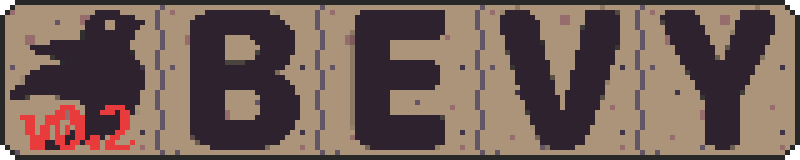

# bevy_tilemap
[](https://crates.io/crates/bevy_tilemap)
[](https://crates.io/crates/bevy_tilemap)
[](https://github.com/joshuajbouw/bevy_tilemap/blob/master/LICENSE)
[](https://github.com/joshuajbouw/bevy_tilemap/actions)

Chunk based tilemap for Bevy game engine.



Bevy Tilemap allows for Bevy native batch-rendered tiles in maps to be 
constructed with chunk based loading, efficiently.

Simple yet refined in its implementation, it is meant to attach to other 
extensible plugins that can enhance its functionality further. Hand-crafted
tilemaps with an attentive focus on performance, and low data usage.

## Features
* Perfect for game jams.
* Easy to use and *mostly* stable API with thorough documentation.
* Endless or constrained tilemaps.
* Batched rendering of many tiles.

## Design 
This is not intended to be just another Tile Map. It is meant to be a framework 
and extensible by design, like Bevy. As well as work done to keep it as close to 
Bevy API as possible while keeping in mind of Rust API best practices. It is not
meant to be complicated and created to be simple to use but give enough 
functionality to advanced users.

Less time fiddling, more time building.

## Usage
Add to your `Cargo.toml` file:
```toml
[dependencies]
bevy = 0.3
bevy_tilemap = 0.1
```

## Simple tilemap construction

At the most basic implementation, there is not a whole lot that is required to
get the tilemap going as shown below.

```rust
use bevy_tilemap::prelude::*;
use bevy::asset::HandleId;
use bevy::prelude::*;

// This must be set in Asset<TextureAtlas>.
let texture_atlas_handle = Handle::weak(HandleId::random::<TextureAtlas>());

let mut tilemap = Tilemap::new(texture_atlas_handle);

// Coordinate point with Z order.
let point = (16, 16, 0);
let tile_index = 0;
tilemap.set_tile(point, tile_index);

tilemap.spawn_chunk_containing_point(point);
```

Of course, using the `Tilemap::builder()` this can be constructed with many more
advanced features.

* Texture atlas.
* Dimensions of the tilemap.
* Dimensions of a chunk.
* Dimensions of a tile.
* Adding Z render layers

With many more features planned for future updates to bring it up to par with
other tilemap implementations for other projects.

# Future plans

There is still a lot to do but the API is now stable and should be fine for a
while now. The next release is focused on added automated methods and system.

- **Auto-tile**: Picks the right tile based around the neighbours of the tile.
- **Auto-spawn**: Automatically handles spawning and despawning of chunks
depending on what the camera is viewing.
- **Auto-configure**: Automatically configures the tilemap based on options 
that it can figure out such as texture sizes and the right size of chunks.
- **Tile import**: Imports tiles from a file from multiple formats.
- **LayeredMap**: Multiple tile maps working together to create 3D slices that
work together and are aware of each other.

# Building

Bevy Tilemap requires Rust 1.43 or later to build.

Once you have a development environment, Bevy Tilemap can be fetched using git:

```bash
$ git clone --recursive https://github.com/joshuajbouw/bevy_tilemap/
```

and then built using cargo:

```bash
$ cargo build --examples
```

cargo can also be used to run tests:

```
$ cargo test
```
