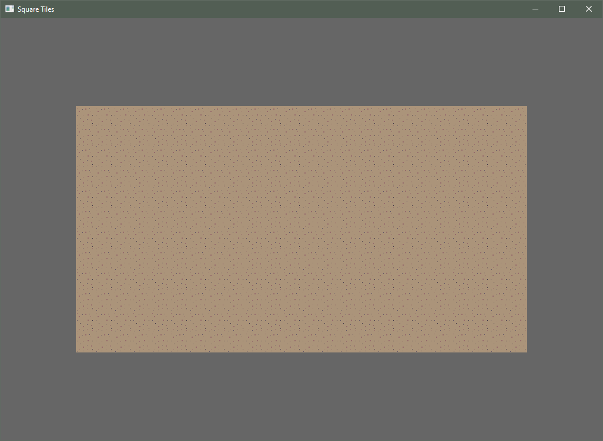
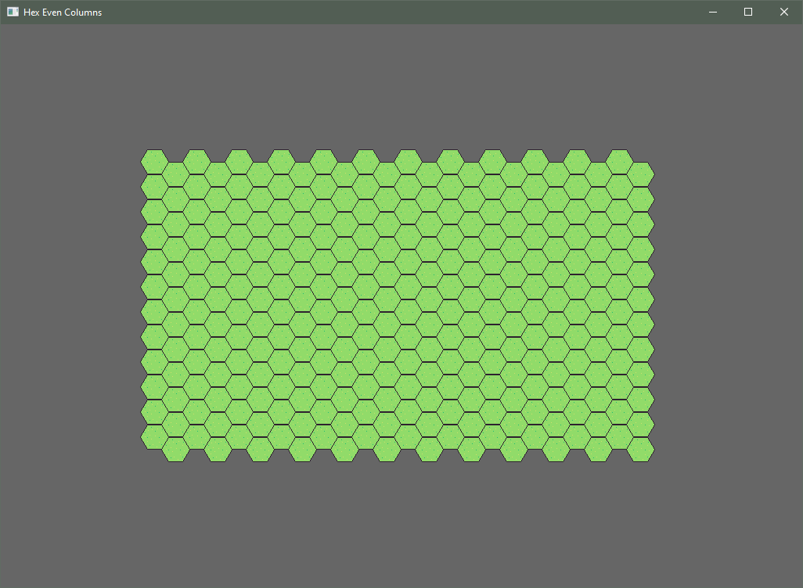
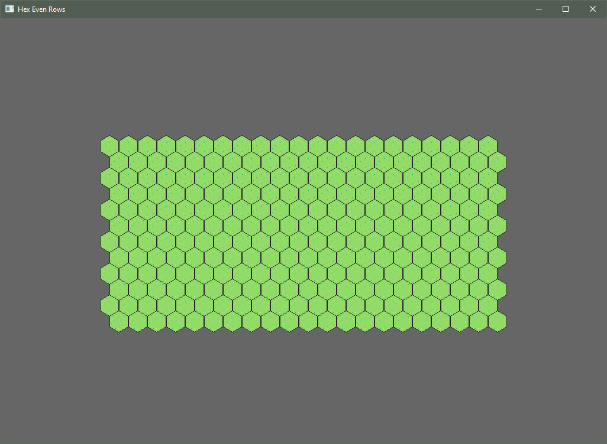
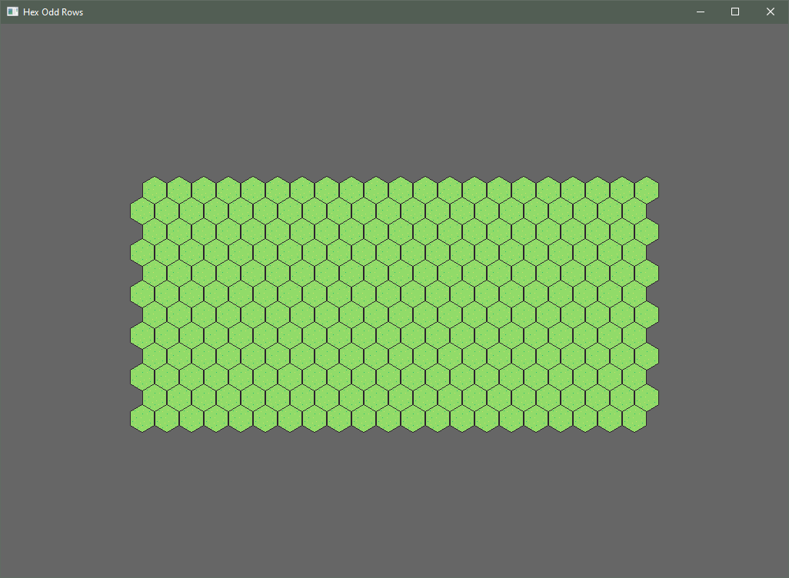
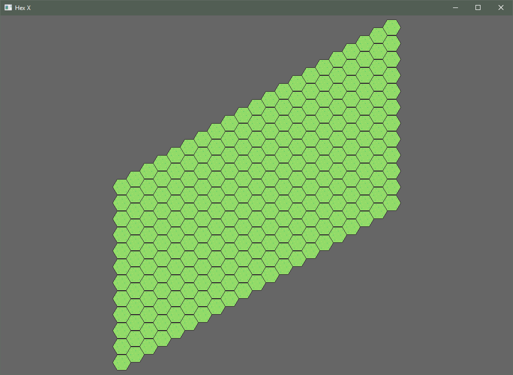
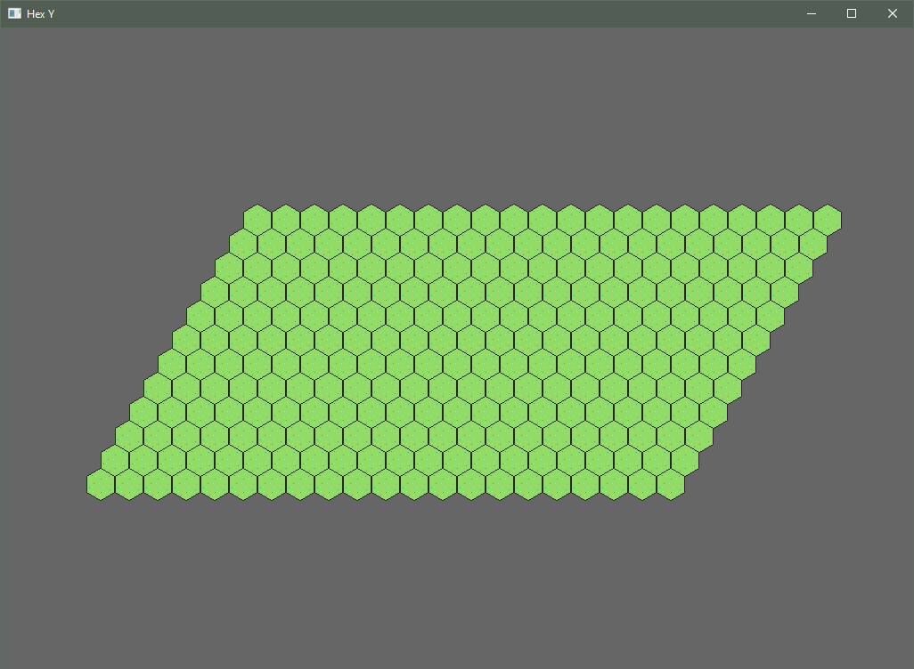
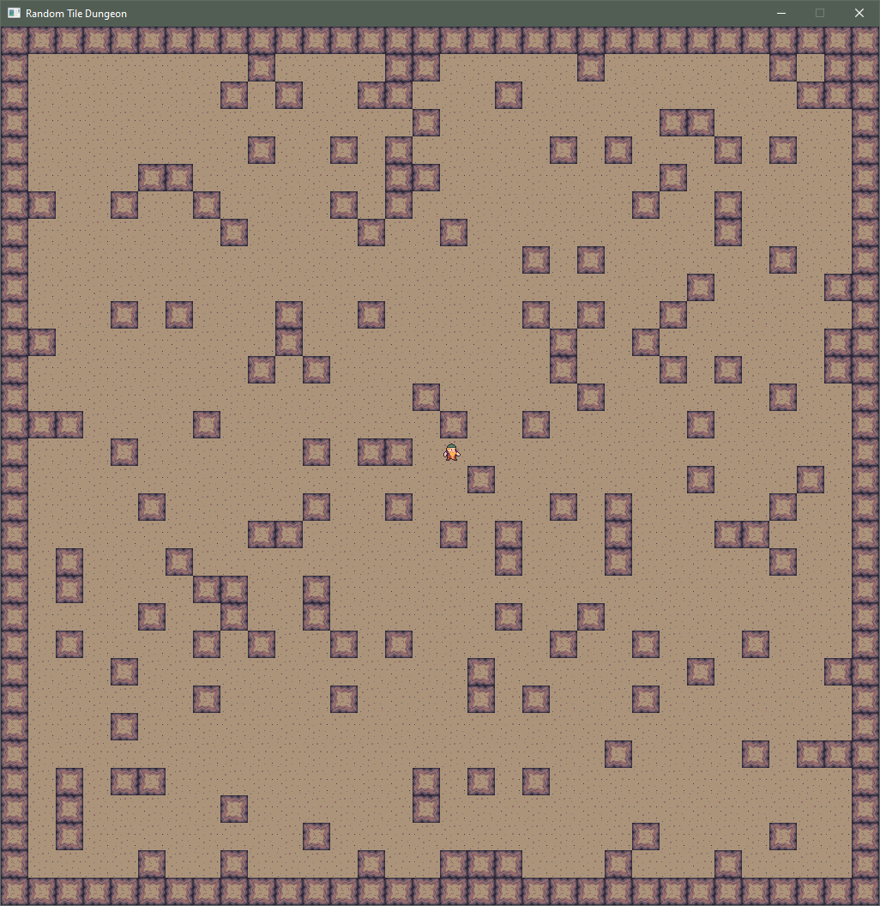
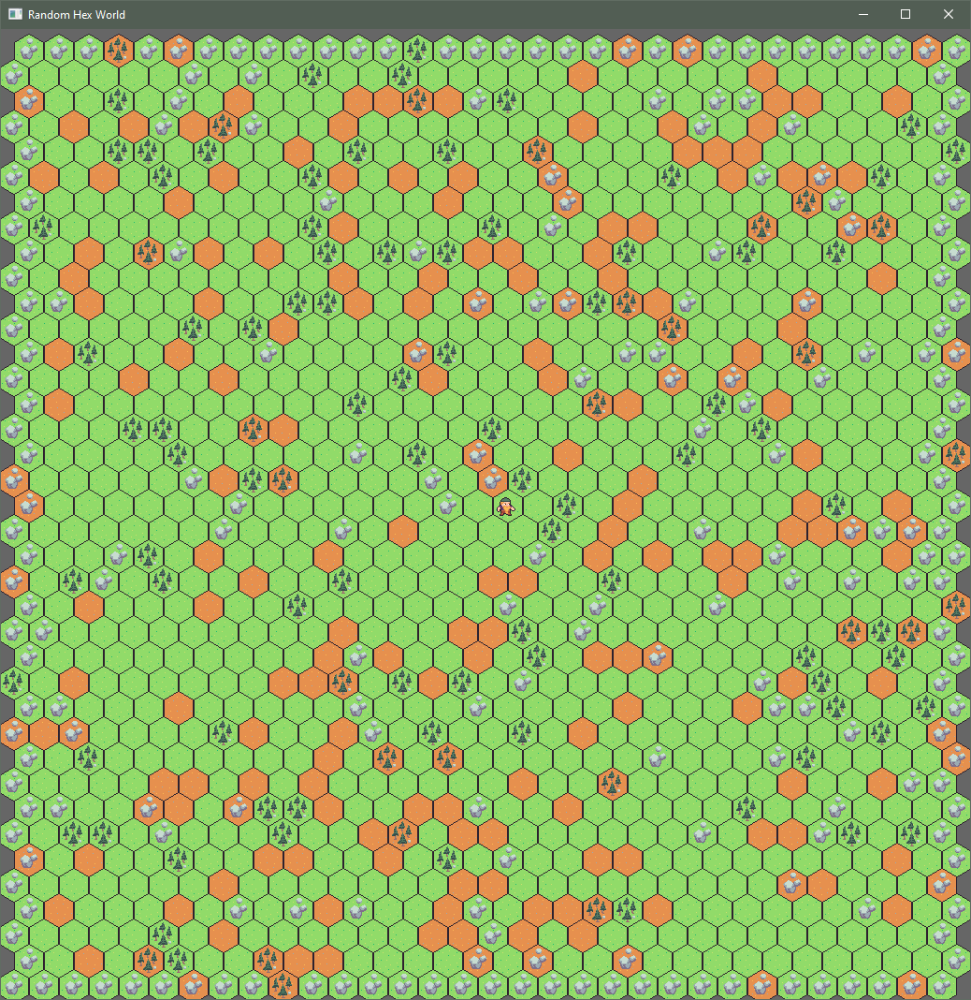

# Bevy Tilemap examples

This crate contains examples and showcases of what is currently possible with 
the Bevy Tilemap plugin. It currently is in its own crate because there is 
currently an issue with Bevy v0.4.0 which prevents `bevy` from being added to
`dev-dependencies` in the `Cargo.toml`.

## Running the examples

To run an example you you can run them based on their name in the example 
folder. For example:

```bash
cargo run --example random_dungeon
```

## Tile topology examples

The two different kinds of topologies that are explored in this library is both 
square and hex. 

Square is typically used for most grid based games that have a 
local map or playing field. Many a creatures and characters have explored on a 
grid system such as this. This is quite common of older RPGs. Movement on
square tiles usually has a different movement length on diagonals opposed to 
going the other directions.

Where as hex is used for pen & paper wargames but not uncommon for world maps
for more some RPGs with world movement. The best part of hexes is that movement
in each direction is treated usually exactly the same in game logic.

### square_tile



### hex_tile_even_cols


### hex_tile_odd_cols



### hex_tile_even_rows



### hex_tile_odd_rows



### hex_tile_x



### hex_tile_y



## Game examples

The most typical use of this library would almost certainly be for games. To get
someone started this library contains two typical examples with player movement.

### random_dungeon



A randomly generated simple dungeon with no entry or exit points. You can move 
the character around with W A S D or H J K L with Y U N M for diagonals, or with
the numpad.

### random_world



A randomly generated overworld with grass, dirty, boulders, and small croppings 
of trees. Movement is done with Q W E A D Z X C.

### stress_dwarves

Simple stress test of pure tilemap sprites stumbling randomly around a map with
simple collisions.

### physics_dungeon

A simple physics and collision demonstration of a dwarf sliding around a random
dungeon.
